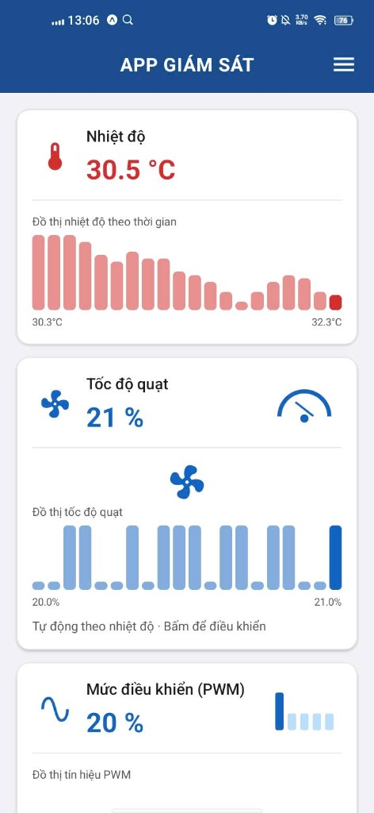
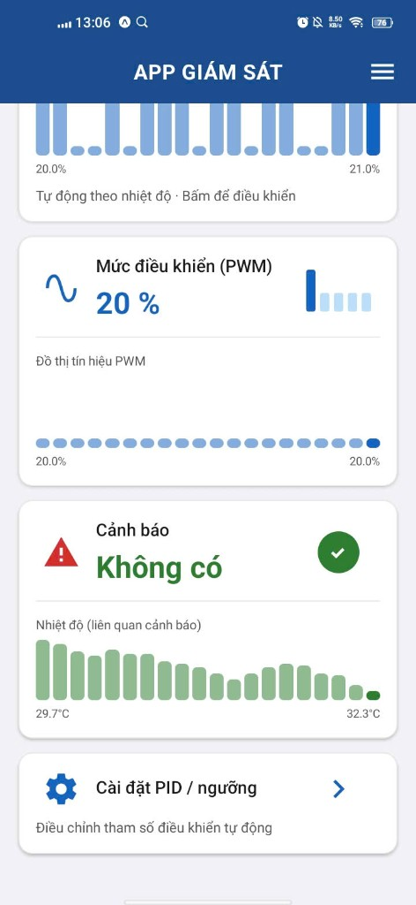
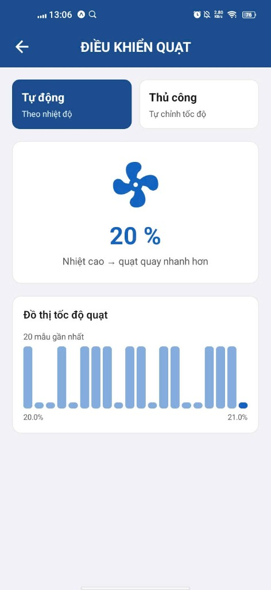
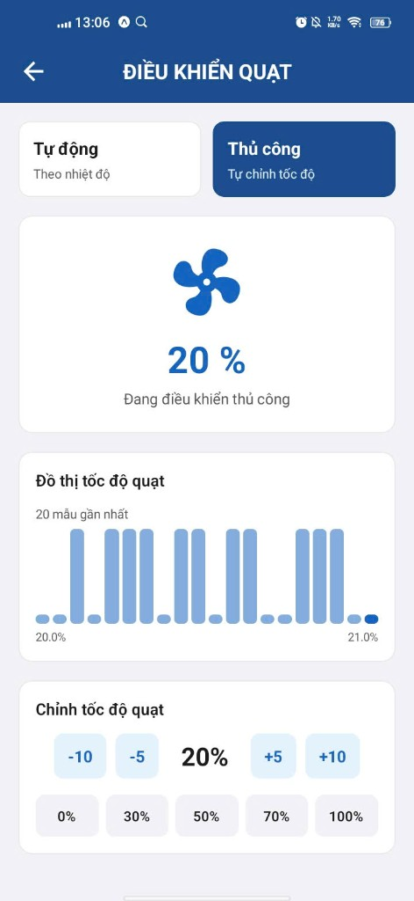
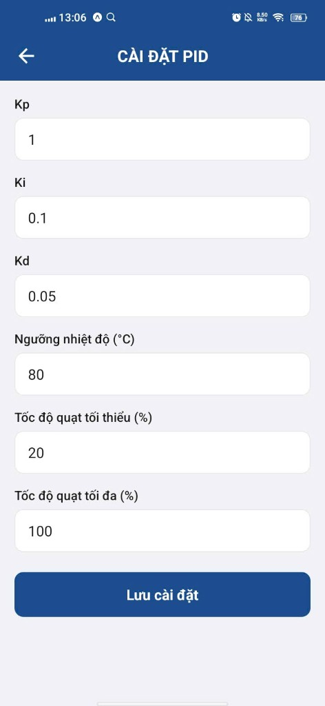

# Hệ thống giám sát & điều khiển quạt

Bài tập lớn môn **Cơ sở đo lường và điều khiển số**.

App mobile xem nhiệt độ, tốc độ quạt, PWM. Backend có thể **mô phỏng** hoặc **nối STM32 thật** qua cổng COM.

## Công nghệ

| Phần | Stack |
|------|-------|
| Mobile | React Native + Expo (`mobile/`) |
| Backend | NestJS + Fastify (`backend/`) |
| Database | PostgreSQL (`infra/`) |

## Chức năng chính

- Xem **nhiệt độ**, **tốc độ quạt**, **PWM** realtime + đồ thị
- **Tự động**: nhiệt cao → quạt quay nhanh hơn (PID)
- **Thủ công**: tự chỉnh tốc độ quạt trên app
- Cảnh báo khi nhiệt vượt ngưỡng
- Cài đặt tham số PID / ngưỡng nhiệt độ

## Giao diện

### Màn hình giám sát





### Điều khiển quạt

Chế độ tự động theo nhiệt độ:



Chế độ thủ công, chỉnh bằng nút +/- hoặc preset:



### Cài đặt PID



## Cấu trúc project

```
mobile/
├── mobile/      # app Expo
├── backend/     # API NestJS
├── infra/       # Docker Postgres
└── docs/        # ảnh demo
```

## Chạy project

`cd` vào thư mục `mobile/` trước.

### 1. Database

```bash
cd infra
cp .env.example .env
docker compose up -d
```

### 2. Backend

```bash
cd backend
cp .env.example .env
npm install
npm run start:dev
```

API chạy tại `http://localhost:3000`

### 3. Mobile

```bash
cd mobile
cp .env.example .env
```

Sửa `EXPO_PUBLIC_API_URL` trong `.env`:
- Máy thật (Expo Go): `http://<IP-máy-tính>:3000`
- Android emulator: `http://10.0.2.2:3000`

```bash
npm install
npx expo start
```

Quét QR bằng Expo Go, điện thoại và máy tính cùng WiFi.

## Nối mạch STM32

```
STM32 (USART2 PA2/PA3) --USB-UART--> PC (COMx) --backend--> mobile app
```

1. Flash firmware STM32, cắm USB-UART (115200 baud)
2. Xem cổng COM: Device Manager hoặc `GET /api/device/ports`
3. Sửa `backend/.env`:

```env
DEVICE_MODE=serial
SERIAL_PORT=COM3
SERIAL_BAUD=115200
```

4. Restart backend — app hiện **STM32 đã kết nối**

| Chế độ | `DEVICE_MODE` | Mô tả |
|--------|---------------|-------|
| Mô phỏng | `simulator` | Không cần mạch |
| Mạch thật | `serial` | Đọc `FAN,...`, gửi lệnh `s/p/i/d/x/r` |

Lệnh từ mobile → backend → UART giống desktop App (`App/`). **Không mở desktop App và backend serial cùng lúc** — một cổng COM chỉ dùng một chương trình.

## API (tóm tắt)

| Method | Endpoint | Mô tả |
|--------|----------|-------|
| GET | `/api/status` | Trạng thái hiện tại (+ RPM/fault khi nối mạch) |
| GET | `/api/device/ports` | Danh sách cổng COM |
| GET | `/api/device/connection` | Trạng thái kết nối STM32 |
| PUT | `/api/status/fan` | Đặt tốc độ quạt |
| PUT | `/api/status/mode` | `auto` / `manual` |
| GET | `/api/telemetry/temperature` | Lịch sử nhiệt độ |
| GET | `/api/telemetry/fan-speed` | Lịch sử tốc độ quạt |
| GET | `/api/telemetry/pwm` | Lịch sử PWM |
| GET/PUT | `/api/settings/pid` | Cài đặt PID |

## Lưu ý

- Postgres Docker dùng port **5433** (tránh trùng Postgres cài sẵn trên máy)
- `DEVICE_MODE=simulator`: dữ liệu mô phỏng, cập nhật mỗi 3 giây
- `DEVICE_MODE=serial`: dữ liệu từ mạch, telemetry mỗi ~200ms
- Cần backend chạy trước khi mở app mobile
